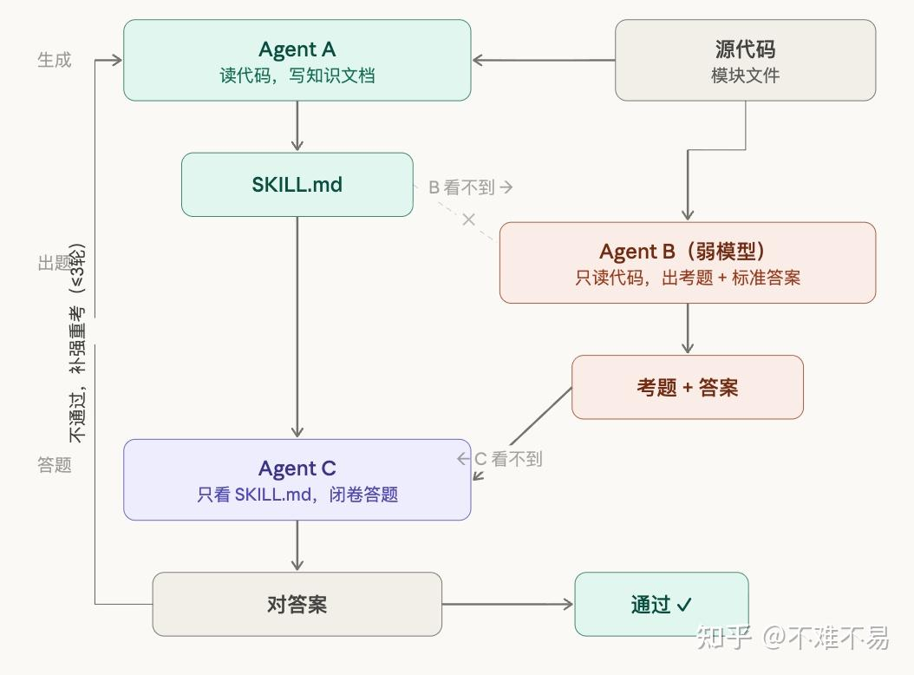
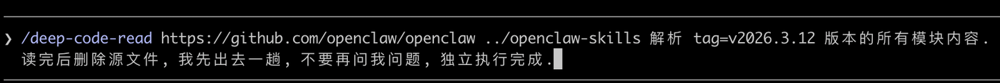
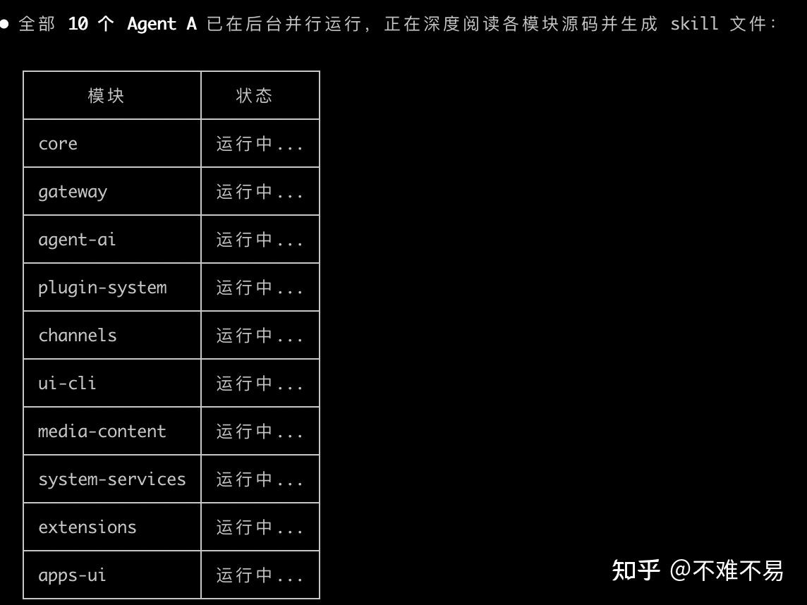
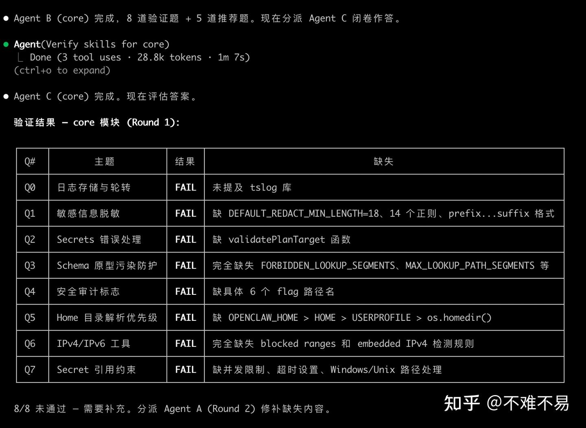
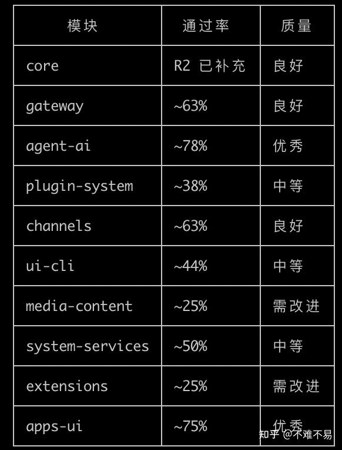
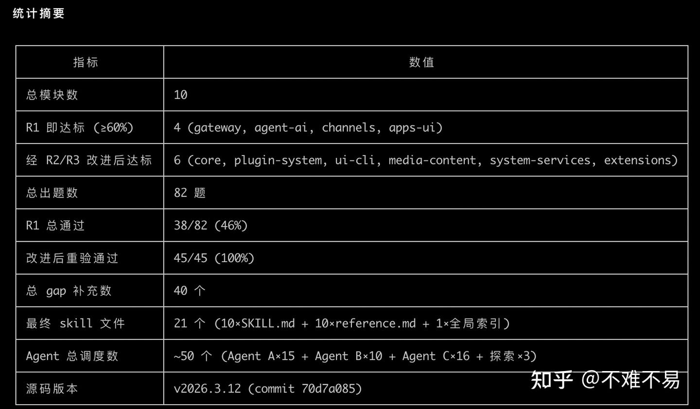
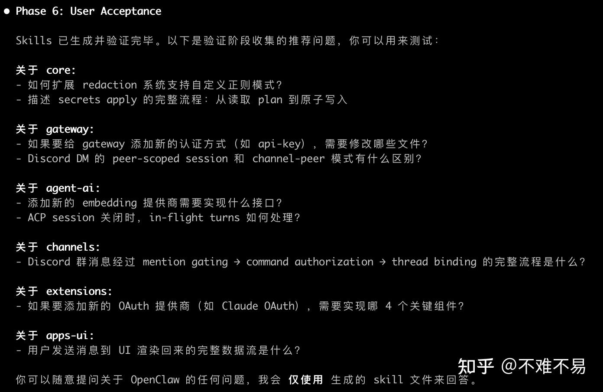

前段时间我在给 OpenClaw 做扩展，需要深入理解它的源码和配置项。一开始的做法很普通：clone 一个仓库，在里面打开一个 Claude terminal，不断让它扫读和精读代码、画架构图和流程图，遇到上下文变长就 `/clear`。

很快就会遇到三个问题：

1. 同一个问题会被反复问到。不同入口、不同模块之间有交叉，单个对话很难覆盖完整。
2. 结论散落在多个上下文里。新开对话时，模型并没有真正“记住”上一次的探索。
3. 理解没有成为项目资产。对代码库的认知停留在聊天记录里，不能被下一个任务稳定复用。

这不只发生在 OpenClaw。接手新项目、给开源项目贡献代码、基于第三方库做定制开发时，都会遇到相同的认知重复成本。

所以我把目标从“让 AI 回答这一次的问题”改成了“让 AI 生成一套以后可以继续使用的代码库知识”。

## 核心方法：A、B、C 三个角色互相校验

第一步先让模型探索代码库，并按功能模块做切分。随后每个模块进入最多三轮的 ABC 流程：

| 角色 | 能看到什么 | 负责什么 | 产出 |
| --- | --- | --- | --- |
| Agent A | 源码、配置和已有上下文 | 深读代码，整理模块知识 | `SKILL.md` |
| Agent B | 源码，看不到 A 的文档 | 独立出题，并写出标准答案 | 题目、答案、覆盖范围 |
| Agent C | 只能看到 A 的 `SKILL.md` | 闭卷回答 B 的问题 | 答案和缺失点 |

验证时，C 的答案会和 B 的标准答案进行比较。如果 C 无法只凭文档回答，说明 A 的文档还存在缺口：回到 A 补充，B 针对尚未覆盖的领域重新出题，C 再考一轮。

```text
源代码 ──┬──> Agent A ──> SKILL.md ──> Agent C ──> 对答案 ──> 通过
         │                                  │           │
         └──> Agent B ──> 题目 + 标准答案 ───┘           └──> 补充后进入下一轮
```

这里有一个很重要的隔离关系：B 不看 A 写的文档，C 不看源码。这样验证的对象就不再是“模型能不能重新找到答案”，而是“知识文档本身是否足够自洽”。



### 为什么 B 使用弱模型

B 的任务是从源码里寻找覆盖面足够广的问题，不是写最深的源码分析。实践中我会让它使用更便宜、更快的模型，例如 Haiku。

弱模型阅读得更粗一些，反而更容易提出适合陌生代码库入门的问题：模块职责是什么、关键入口在哪里、状态如何流转、修改一个功能需要触碰哪些文件。这样可以把昂贵模型的上下文留给真正需要深入推理的工作。

### 为什么每轮都要出新题

B 会看到前几轮已经出过的题，但下一轮需要覆盖尚未测过的领域。这样 A 需要补全整个知识面，而不是只围绕已知题目修改文档。

这是一个很朴素的反应试策略：题目不断扩大覆盖面，文档才有机会从局部总结逐渐变成模块级知识库。

## `SKILL.md` 应该记录什么

每个模块的知识文件至少覆盖五个维度：

1. **职责与能力**：模块做什么，公开 API 和关键函数签名是什么。
2. **核心设计逻辑**：为什么这样设计，重要的架构决策和取舍是什么。
3. **数据结构**：核心类型、接口，以及它们之间的关系。
4. **状态流转**：数据从哪里进入，经过哪些步骤，错误如何处理。
5. **修改指南**：如果要增加一种新的能力，需要修改哪些文件、哪些入口和哪些测试。

第五项对日常开发最有帮助。读代码的目的通常是为了在上面继续改东西，直接告诉我应该动哪些文件，比泛泛讲一遍架构更能缩短下一次任务的启动时间。

除此之外，工具还会生成一个全局索引，记录：

- 每个模块的一句话职责；
- 模块之间的依赖关系；
- 跨模块功能的入口和操作路径；
- 常见修改任务涉及的文件集合。

理想情况下，新对话只需要先读全局索引，再按任务加载相关模块的 `SKILL.md`。知识文件是按模块分区的，索引负责导航，二者一起控制上下文的大小。

## 安装和使用

安装 skill：

```bash
git clone https://github.com/CiferaTeam/deep-code-reader.git
cp -r deep-code-reader/deep-code-read ~/.claude/skills/
```

然后可以对远程仓库或本地路径启动阅读：

```text
/deep-code-read https://github.com/example/project ~/.claude/skills/
# 或者本地路径
/deep-code-read ./path/to/project ~/.claude/skills/
```

这里使用了 `superpowers` 作为格式化依赖。整个流程的重点是让探索、精读、出题、验证和整理形成一个可重复的工作流，而不是每次临时组织一组 prompt。

## 一次 OpenClaw 实战

下面的截图来自我当时阅读 OpenClaw `v2026.3.12`（commit `70d7a085`）的一次运行。它们记录的是那个版本的代码和运行结果，随着项目演进，具体模块名、常量和函数位置会变化。

我在睡前启动任务，让它按模块并行深读。第二天回来时，第一屏已经显示 10 个 Agent A 在后台运行：



随后工具按模块展示进度：



一次完整运行的统计结果大致是：

- 总共 10 个模块；
- 第一轮生成 82 道题；
- 第一轮通过 38/82，约 46%；
- 40 个缺口被标记并回传给 Agent A；
- 改进后的 45/45 道复核题全部通过；
- 最终生成 21 个 skill 文件：10 个模块文档、10 个参考文档和 1 个全局索引；
- Agent 总调度次数约 50 次。

这组数字并不代表工具在所有仓库上都能达到同样效果，但它说明了一件事：第一次“看起来读完了”的结果，确实可能离可复用还有很大距离。

### 第一轮失败并不等于流程失败

第一轮验证时，`core` 模块的 8 道题全部没有通过。缺口包括日志轮转、敏感信息脱敏、Secrets 错误处理、Schema 原型污染防护、Home 目录优先级、IPv4/IPv6 工具和 Secret 引用约束等细节。



如果只看 Agent A 的第一版总结，这些内容很容易被认为是“已经覆盖”。闭卷验证把它们变成了可操作的补充清单。

第二轮开始，Agent A 只需要针对缺口继续补充：



经过后续验证，模块级质量和覆盖率逐步稳定下来：



最终统计里可以看到，第一轮只通过 38/82，道路上补了 40 个 gap；补充后的复核题为 45/45 全部通过：



### 用生成的知识回答实际问题

完成阅读后，我没有立刻再翻源码，而是直接用生成的 skill 提问。下面是其中几个问题的缩写版。

#### 对话轮数、UI 裁剪和 compaction 是三件事

问题是：OpenClaw 的 channel 里显示了最大对话轮数，是否意味着历史超过长度后会不断淘汰前面的内容，从而造成大量 LLM cache miss？

当时的分析把它拆成两层：

1. **UI 显示层**：`ChatLog` 组件有 `maxComponents`，超过阈值后由 `pruneOverflow()` 移除较早的 UI 组件。这影响渲染性能和屏幕上的内容。
2. **LLM 上下文层**：每轮结束后由 `afterTurn()` 检查 token 预算，超过预算时触发分阶段摘要，再按上下文份额裁剪历史。

当时阅读到的主流程可以简化成：

```text
afterTurn()
  -> 检查 token 预算
  -> summarizeInStages()
       -> chunkMessagesByMaxTokens()
       -> summarizeWithFallback()
       -> 合并阶段摘要
  -> pruneHistoryForContextShare()
```

当时版本的关键参数包括 `BASE_CHUNK_RATIO=0.4`、`MIN_CHUNK_RATIO=0.15`、`SAFETY_MARGIN=1.2` 和 `SUMMARIZATION_OVERHEAD_TOKENS=4096`。这些值只属于那次阅读的代码快照，不能替代当前版本的源码检查。

这个问题的结论是：compaction 会让 prompt 前缀从原始消息变成摘要，依赖 prefix matching 的缓存可能因此失效；但它通常是接近上下文预算时发生的一次阶段性变化，cache miss 更像周期性的尖峰，而不是每一轮都发生。

#### Slack thread 和 Feishu 单窗口如何进入上下文

第二个问题是：Slack 有二级 thread，Feishu 更接近单窗口，它们串联聊天内容时格式是否一样？

从 LLM 看到的消息结构看，各渠道会先归一成类似 `MsgContext` 的对象：

```text
MsgContext {
  Channel: "slack" | "feishu" | ...
  ChatType: "direct" | "group" | "channel"
  Body: string
  ReplyToId: string
  MessageThreadId: string
  ThreadLabel: string
}
```

真正影响上下文边界的是 session key 和 thread binding：

| 维度 | Slack thread | Feishu 单窗口 |
| --- | --- | --- |
| LLM 看到的消息结构 | 统一的消息上下文 | 统一的消息上下文 |
| session 粒度 | thread 可以形成独立 session | 多条消息共享窗口级 session |
| 历史范围 | 当前 thread 的消息 | 当前窗口积累的消息 |
| compaction 压力 | 通常较小 | 容易随着窗口变长而增加 |

所以“消息格式是否一致”和“上下文边界是否一致”是两个问题。前者可以统一，后者由渠道的线程语义和 session 策略决定。

#### 每轮调用工具前，哪些位置可以插入逻辑

第三个问题更偏架构：每轮调用工具前的 context 串联流程里，哪些插件和 hook 可以替换？

当时整理出的主链路是：

```text
收到消息
  -> 构建 MsgContext
  -> before_model_resolve
  -> 加载 workspace 文件
  -> before_prompt_build
  -> Context Engine assemble
  -> Memory Search
  -> LLM API Call
  -> before_tool_call
  -> 执行工具
  -> tool_result_persist / before_message_write
  -> afterTurn / compaction
```

几个关键插入点的职责不同：

| Hook | 适合做什么 |
| --- | --- |
| `before_model_resolve` | 根据任务选择 provider 或 model |
| `before_prompt_build` | 在 system context 前后注入经过授权的内容 |
| `before_tool_call` | 修改、阻止或取消工具调用 |
| `tool_result_persist` | 在结果写入 transcript 前做脱敏和过滤 |
| `before_message_write` | 修改或阻止消息落盘 |
| `message_sending` | 修改或取消即将发送的消息 |

除了 hook，还有三个可以整体替换的模块级 slot：

- **Context Engine**：替换 `assemble()`、`compact()`、`ingest()` 和 `afterTurn()` 的实现；
- **Memory Engine**：替换记忆检索后端，改变检索结果的来源；
- **ACP Runtime**：通过插件 API 注册不同的 session 执行后端。

Prompt 注入需要单独看权限。`before_prompt_build` 和 `before_agent_start` 能够改变模型上下文，因此当时的系统默认要求插件显式打开 `allowPromptInjection` 才能注入 system context。

这些结论的价值不在于记住所有 hook 名称，而是建立一张修改导航图：想改模型路由、prompt 拼接、工具调用、transcript 持久化或 context engine 时，先去对应的边界找实现。

## 实际使用建议

### 把深读当作后台任务

一个中等大小的项目，5–10 个模块可能需要一两个小时。适合在不需要交互的时间启动，第二天直接检查生成的索引、失败题目和补充轮次。

### 只读真正要改的模块

不必每次都覆盖整个仓库。如果当前任务只涉及 gateway、agent-ai 和 channels，就先选择这些模块，等需要跨模块修改时再补读其他部分。

### 把产出的 skill 放进工作区

把模块文档和全局索引放到 coding agent 能稳定加载的位置。新对话先读索引，再加载相关模块，能让上下文更小，也让“我上次已经读过这个项目”变成可复用的事实。

### 用测试题而不是字数判断质量

一份文档写得很长，不代表它真的覆盖了代码。更可靠的检查是：

- C 能否只凭文档回答模块入口和关键状态流转；
- C 是否能指出新增功能应该修改的文件；
- 文档里的函数、常量和路径是否能在对应版本的源码中定位；
- 全局索引能否把一个跨模块问题导航到正确的局部文档。

## 需要留意的边界

这套方法很有用，但产出的知识仍然有明确的版本边界。

- **大型重构需要重新学习**：小改动可以增量补充，大范围重构可能让旧文档产生误导；
- **敏感代码需要控制输入**：私有仓库、密钥、客户数据和内部配置不应未经授权发送给外部模型；
- **知识文档不能替代源码验证**：涉及安全、数据迁移和运行时行为时，仍要回到当前 commit 做测试；
- **时间和 token 有成本**：B 的弱模型可以控制成本，但 A、C 的多轮校验仍然需要预算。

这些边界也说明了它适合扮演什么角色：它是代码库的认知索引和修改导航，不是脱离版本控制的永久真相。

## 适合谁用

目前最直接受益的是需要频繁阅读陌生代码的一线开发者：

- 给框架写插件；
- 理解第三方库内部机制后继续扩展；
- 接手一个没有完整文档的项目；
- 在多个 coding agent 对话之间复用同一套代码库知识。

更广一点看，这套“让 AI 系统性学习一个领域，再用考试验证，最后沉淀为可加载知识”的思路并不局限于代码。它也可以用来整理协议、运行手册和长期维护的领域经验。

## 结语：沉淀一套可插拔的认知库

我最想留下的并不是某个 `SKILL.md` 文件，而是一个工作方式：

1. 先把探索范围切成可以管理的模块；
2. 让不同角色分别负责理解、出题和验证；
3. 把失败答案转化成补充清单；
4. 把验证通过的内容保存成下一次可以直接加载的知识。

重要的不是 skills 的数量，而是从今天开始沉淀自己的“可插拔认知库”。当新任务再次来到时，AI 不必从空白上下文重新认识整个项目，人也可以把时间花在真正的设计和修改上。

工具已经开源：

- [deep-code-reader](https://github.com/CiferaTeam/deep-code-reader)，MIT 协议；
- [openclaw-skills](https://github.com/CiferaTeam/openclaw-skills)，本次阅读过程中生成的 OpenClaw skills。

目前它在 Claude Code 上测试通过，设计上保持平台无关，理论上也适用于能够加载 skill 文件并调度子 agent 的编程工具。欢迎通过 GitHub issue 交流问题和建议。
